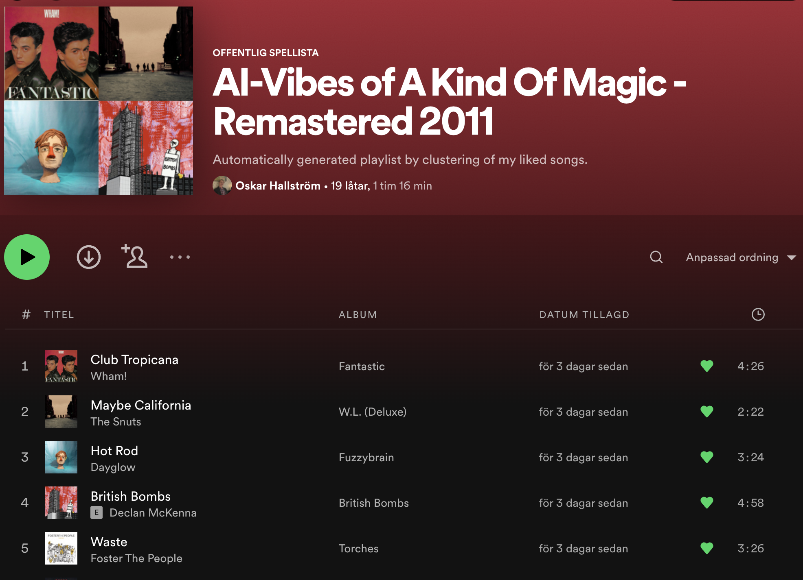

# Spotify-ML-Playlist-Creator

I created this little fun thing in the summer of 2021, and since then I have made some minor changes to the code, as for example when testing other distance measures.

By performing agglomerative clustering on your liked songs on spotify, this script automatically creates playlists with songs that are similar to each other according to spotify's audio features. The names of the playlists are based on the approximated medoid of each cluster.

Below you can see one of the playlists that was generated for my spotify account.

In order to listen, or see all of the songs in this playlist, click on this [link](https://open.spotify.com/playlist/6SPeSK2EENN0lAO2fVjOxM?si=e512c6b1de654493)!
